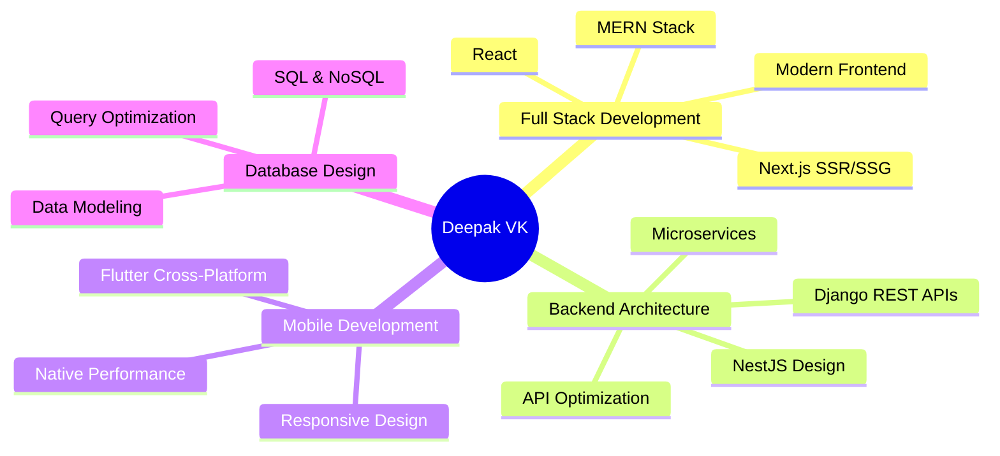

# Deepak VK — Full Stack Developer


<div align="center">

<!-- Animated Header -->


<!-- Typing SVG -->
<a href="https://git.io/typing-svg"></a>

<!-- Profile Views Counter -->


<!-- Social Badges -->
<p>
  <a href="https://deepakdevhub.vercel.app" target="_blank">
    
  </a>
  <a href="https://github.com/deepak-devhub" target="_blank">
    
  </a>
  <a href="mailto:deepakvk6334@gmail.com">
    
  </a>
</p>

</div>

---

## 🚀 About Me

## 👋 Hi, I'm **Deepak VK** — Full Stack Developer

I'm **Deepak VK**, a Full Stack Developer from Kerala, India.
I specialize in MERN, Django, Next.js, NestJS, Flutter, and build scalable, high-performance web & mobile applications.
I work on clean architecture, API design, modern UI/UX, and production-ready software development.
My expertise includes React, Next.js, Node.js, NestJS, Django, FastAPI, Flutter, MongoDB, PostgreSQL, MySQL, and cloud deployments.
I’m currently focused on creating efficient, user-centric digital solutions and optimizing backend performance.


<div align="center">

### 🎯 **Mission**: Transform ideas into robust, scalable digital solutions

</div>

---

## 💻 Tech Arsenal

<div align="center">

### 🔤 Languages
<p>
  
</p>

### 🎨 Frontend Mastery
<p>
  
</p>

### ⚙️ Backend & APIs
<p>
  
</p>

### 📱 Mobile Development
<p>
  
</p>

### 🗄️ Databases
<p>
  
</p>

### 🛠️ DevOps & Tools
<p>
  
</p>

</div>

---

## 🏆 Featured Projects

<div align="center">

<table>
<tr>
<td width="50%">

### 📚 LMS - Library Management
**Next.js • Razorpay • SEO Optimized**

- 📖 Advanced book management system
- 💳 Integrated payment gateway
- 👥 Admin & user dashboards
- 🔍 SEO-optimized pages

</td>
<td width="50%">

### 🛒 E-Commerce Platform
**React • NestJS • SQL**

- 🔐 Full authentication & authorization
- 🛍️ Cart, orders, admin panel
- ⚡ Custom caching layer
- 🚀 Optimized DB queries

</td>
</tr>

<tr>
<td width="50%">

### 📝 Blog Platform
**React • NestJS • SQL**

- 🔒 Secure backend architecture
- 👤 Role-based access control
- 🎨 Modern, responsive UI
- 📊 Content management system

</td>
<td width="50%">

### 🎓 Student Management System
**Django • Token Authentication**

- 👨‍🎓 Students, teachers, admin modules
- 📅 Attendance tracking
- 📈 Grade management
- 🔐 Secure token-based auth

</td>
</tr>

<tr>
<td colspan="2">

### 🏥 CareSync - Health Management
**Django • Flutter • AI Integration**

✔️ Appointment scheduling • ✔️ Digital prescriptions • ✔️ AI-powered diet plans  
✔️ Lab report management • ✔️ Complete Hospital-Doctor-Patient workflow

</td>
</tr>
</table>

</div>

---

## 📊 GitHub Statistics

<div align="center">


</div>

---

## 📈 Contribution Activity

<div align="center">


</div>

---

## 🐍 Contribution Snake

<div align="center">


</div>


---

## 🎖️ Key Achievements

<div align="center">

```yaml

🏆 Built 5+ Production-Ready Full Stack Applications
💼 Developed Healthcare Management System with AI Integration  
🚀 Created E-Commerce Platform with Custom Caching
📚 Implemented Library Management with Payment Gateway
🎓 Designed Student Management System with Token Auth
📱 Developed Cross-Platform Mobile Apps using Flutter
⚡ Optimized Database Queries for Better Performance
🔐 Implemented Secure Authentication & Authorization
📊 Built RESTful APIs with NestJS & Django
🌐 Deployed Applications on Vercel,
```

</div>

---

## 💡 What I Bring to the Table

<div align="center">



</div>

---

## 🌟 Why Work With Me?

<div align="center">

<table>
<tr>
<td align="center" width="25%">

### 🎯 Focused
Production-ready solutions with performance optimization

</td>
<td align="center" width="25%">

### 💼 Professional
Clean, maintainable code following best practices

</td>
<td align="center" width="25%">

### 🚀 Innovative
Modern tech stacks and cutting-edge solutions

</td>
<td align="center" width="25%">

### 🤝 Collaborative
Team player with clear communication

</td>
</tr>
</table>

</div>

---

## 📫 Get In Touch

<div align="center">

[](https://deepakdevhub.vercel.app)
[](mailto:deepakvk6334@gmail.com)
[](https://github.com/deepak-devhub)

<br>

### 💬 "Let's build something extraordinary together!"


</div>

---

<div align="center">

<!-- Animated Footer -->


**⭐ From [deepak-devhub](https://github.com/deepak-devhub) with 💙**

</div>
